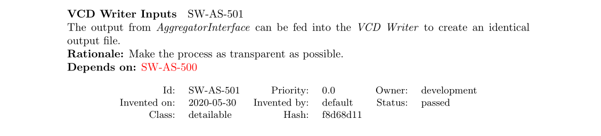
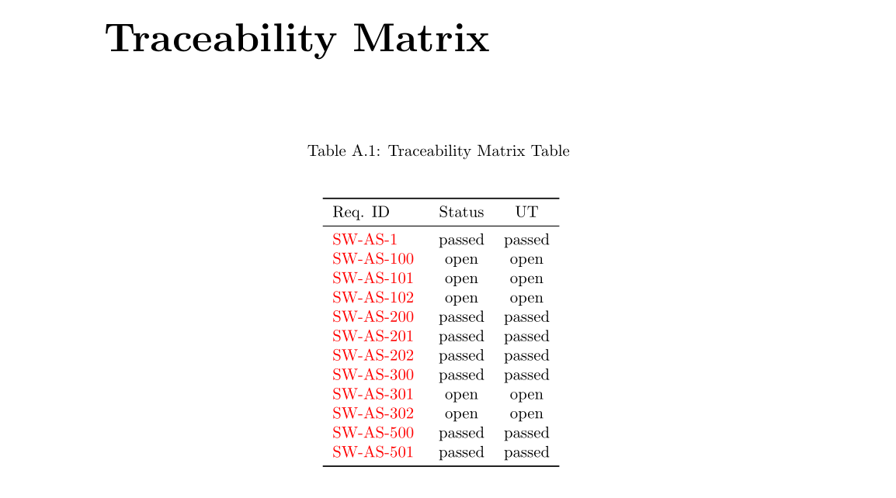

# Summary

A simple way to edit and track requirements in your repository. Export and
import items using Excel sheets. Automatically create PDF documents from the
stored specification items.

Create close-out references that get invalidated as soon as the requirements
change.

See [Quick-Start](#quick-start) to just try it out.

# Introduction

Once upon a time people learned how to write software[^2].  Then people 
started doing *frozen waterfall*[^3], which was never the idea.

    And some things that should not have been forgotten were
    lost. History became legend. Legend became myth. And for
    two and a half decades, the paper passed out of all 
    knowledge.

    - Galadriel, CTO Lothlórien


Because the *frozen waterfall* didn't deliver (obviously), there was a 
counter-revolution: *Agile* with the following four bullet-points:

1. Individuals and interactions over processes and tools
2. **Working software over comprehensive documentation**
3. Customer collaboration over contract negotiation
4. Responding to change over following a plan 

[comment]: # (We've now succesfully replaced planning with action-bias.)


## DevOps

Fast feature-implementation required quick delivery to customer. Hence the deployment had to be 
automated, which means even more code. Who writes the code? The developer and *DevOps* was born.

Deployment straight out of your CI pipline: continuous delivery (CD).

Point two above guarantees that there was no documentation for the customer's managers.


## DevSecOps

Security is important. Who would've thought? And still no documentation for managers.

## ReqDevSecOps

It seems that [SAFe](https://www.scaledagileframework.com/) is now the standard for doing agile. 
Even in its smallest version (Essential) there's a *product manager* whose role is, among others, 
to provide requirements for the project. 

At this point it boils down to writing down what's been said in point 2 and verify it through 
testing. Because testing wants everything in its CI-pipeline before pushing to production, we 
also need to verify against the requirements and fail the build if upstream requirements have
changed without affecting the code.

For free we get the documents managers can read and understand, i.e. not code.


# Proposition

A solution is proposed to keep requirements and the other deliverables in 
sync. For this all requirements documents have to be added to the CI/CD 
pipeline.

Close-out references to requirements, e.g., test specifications, contain a 
reference to the requirement's ID, e.g., `SW-AS-501`. 

To propagate changes in requirements downstream, a hash is calculated over
the relevant part of the requirements. These are then added to the close-out
reference. This modifies the previous reference to, e.g., `SW-AS-501-f8d68d11`.

## Requirements

In the following image a reference specification item is shown.



The item's identifier is given next to the title. The hash calculated over the
title, description and identifier.

## Close-out Reference

The previous specification item `SW-AS-501` has a close-out reference in the
unit-tests[^1]. 

```python
def test_read_write_engines(record_property, dummy_vcd_file):
    """Write-back from read file, equal output"""
    record_property('req', 'SW-AS-501-f8d68d11')
    record_property('req', 'SW-AS-500-4c1a395a')
    ofile = 'test_writeback.vcd'
    reader = pymergevcd.vcd_reader.factory(dummy_vcd_file)
    writer = pymergevcd.vcd_writer.factory(ofile)

    writer.process_source(reader)
    assert filecmp.cmp(dummy_vcd_file, ofile)
```

The previously defined `record_property` results in the following entry in the
xunit XML results file `result.xml`.

```xml
<testcase classname="tests.test_io_manager" file="tests/test_io_manager.py" line="20" name="test_read_write_engines" time="2.830">
  <properties>
    <property name="req" value="SW-AS-501-f8d68d11"/>
    <property name="req" value="SW-AS-500-4c1a395a"/>
  </properties>
</testcase>
```

The `result.xml` file is then used to derive the traceability matrix. 




[^1]: Please don't do this 

# Reference Implementation

The previous examples have been taken from the reference implementation. The 
[`pymergevcd`](https://kown7.github.io/pymergevcd) project also serves as a reference 
implementation 


## Quick-Start

Download the [ZIP file](assets/template_project.zip) and run the`./run.sh`
script (or `./run-docker.sh` if Docker is installed). Without Docker, a working
Python 3 installation is required. This generates the documents in the
`artifacts/` directory, especially the `specification.pdf` and
`specification.xlsx`.

The generated spreadsheet can be distributed to stakeholders to be modified. If
it's copied to the `imports` folder, the changes will be incorporated with the
next run.

* show example of adding it to CI pipeline
* maybe run it in gitlab?

## Installation Details


# References 

[^2]: [Managing The Development Of Large Software Systems, Dr. Winston W. Royce](http://www-scf.usc.edu/~csci201/lectures/Lecture11/royce1970.pdf)  
[^3]: [BA Wiki Waterfall](http://www.bawiki.com/wiki/Waterfall.html)
